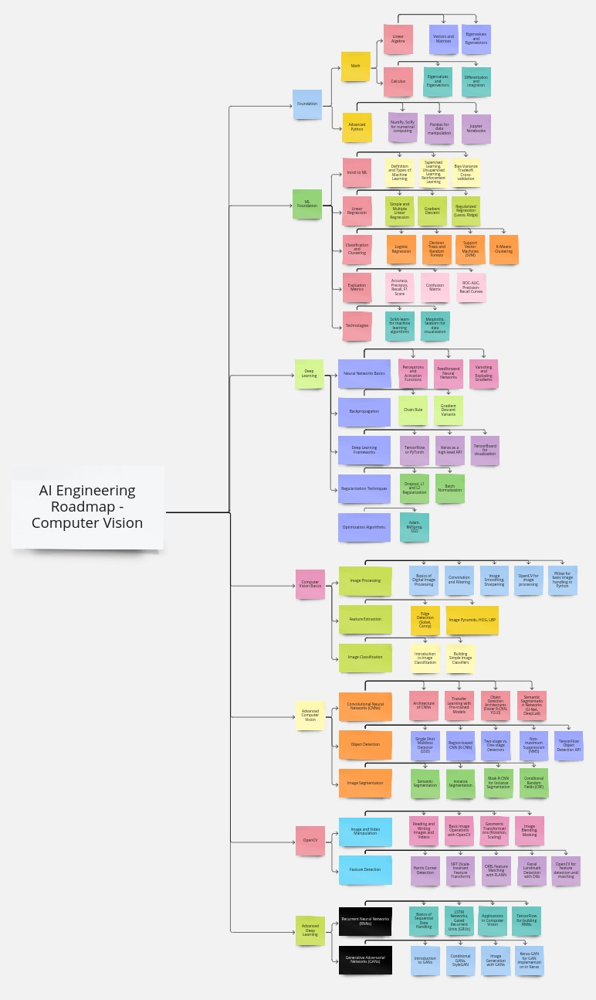

# AI Engineering Roadmap 

## Computer Vision Path
  

## 1. Foundational Knowledge:
* Mathematics:
     * Linear Algebra:
          * Vectors and Matrices:
          * Eigenvalues and Eigenvectors
     * Calculus:
          * Multivariate Calculus
          * Differentiation and integration
* Advanced Python:
     * NumPy, SciPy for numerical computing
     * Pandas for data manipulation
     * Jupyter Notebooks

## 2. Machine Learning Fundamentals:
* Introl to ML:
    * Definition and Types of Machine Learning
    * Supervised Learning, Unsupervised Learning, Reinforcement Learning
    * Bias-Variance Tradeoff, Cross-validation
* Linear Regression:
    * Simple and Multiple Linear Regression
    * Gradient Descent
    * Regularized Regression (Lasso, Ridge)
* Classification and Clustering:
    * Logistic Regression
    * Decision Trees and Random Forests
    * Support Vector Machines (SVM)
    * K-Means Clustering
* Evaluation Metrics:
    * Accuracy, Precision, Recall, F1 Score
    * Confusion Matrix
    * ROC-AUC, Precision-Recall Curves
* Technologies:
    * Scikit-learn for machine learning algorithms
    * Matplotlib, Seaborn for data visualization
## 3. Deep Learning Fundamentals:
* Neural Networks Basics:
    * Perceptrons and Activation Functions
    * Feedforward Neural Networks
    * Vanishing and Exploding Gradients
* Backpropagation:
    * Chain Rule
    * Gradient Descent Variants
* Deep Learning Frameworks:
    * TensorFlow or PyTorch
    * Keras as a high-level API
    * TensorBoard for visualization
* Regularization Techniques:
    * Dropout, L1 and L2 Regularization
    * Batch Normalization
* Optimization Algorithms:
    * Adam, RMSprop, SGD

## 4. Computer Vision Basics:
* Image Processing:
    * Basics of Digital Image Processing
    * Convolution and Filtering
    * Image Smoothing, Sharpening
    * OpenCV for image processing
    * Pillow for basic image handling in Python 
* Feature Extraction:
    * Edge Detection (Sobel, Canny)
    * Image Pyramids, HOG, LBP 
* Image Classification:
    * Introduction to Image Classification
    * Building Simple Image Classifiers
 
## 5. Advanced Computer Vision:
* Convolutional Neural Networks (CNNs):
    * Architecture of CNNs
    * Transfer Learning with Pre-trained Models
    * Object Detection Architectures (Faster R-CNN, YOLO)
    * Semantic Segmentation Networks (U-Net, DeepLab)
* Object Detection
    * Single Shot Multibox Detector (SSD)
    * Region-based CNN (R-CNN)
    * Two-stage vs. One-stage Detectors
    * Non-maximum Suppression (NMS)
    * TensorFlow Object Detection API
* Image Segmentation
    * Semantic Segmentation
    * Instance Segmentation
    * Mask R-CNN for Instance Segmentation
    * Conditional Random Fields (CRF)

## 6. Advanced Deep Learning:
* Recurrent Neural Networks (RNNs):
    * Basics of Sequential Data Handling
    * LSTM Networks, Gated Recurrent Units (GRUs)
    * Applications in Computer Vision
    * TensorFlow for building RNNs
* Generative Adversarial Networks (GANs):
    * Introduction to GANs
    * Conditional GANs, StyleGAN
    * Image Generation with GANs
    * Keras-GAN for GAN implementation in Keras
  
## 7. OpenCV:
* Image and Video Manipulation:
    * Reading and Writing Images and Videos
    * Basic Image Operations with OpenCV
    * Geometric Transformations (Rotation, Scaling)
    * Image Blending, Masking
* Feature Detection:
    * Harris Corner Detection
    * SIFT (Scale-Invariant Feature Transform)
    * ORB, Feature Matching with FLANN
    * Facial Landmark Detection with Dlib
    * OpenCV for feature detection and matching 

## 8. Real-world Applications:
* Kaggle:
    * Explore Image Segmentation Challenges
    * Participate in Transfer Learning Competitions
* Collaborate:
    * Join AI Research Groups or Labs
    * Contribute to Open-source Computer Vision Projects

## 9. Advanced Topics and Technologies:
* Attention Mechanisms:
    * Transformers in Computer Vision
    * Vision Transformer (ViT)
* Contrastive Learning and Self-supervised Learning:
    * SimCLR, BYOL
    * Unsupervised Representation Learning
* Technologies
    * Hugging Face Transformers library
    * PyTorch Lightning for project structure 

## 10. Stay Updated:
* Research Papers and Conferences:
    * Regularly Read Papers on ArXiv
    * Attend or Follow CVPR, ECCV, NeurIPS
* Blogs and Journals:
    * Medium, Towards Data Science, ArXiv Sanity for Blogs
    * AI Conference Websites for Proceedings and Videos

## 11. Networking and Soft Skills:
* Meetups and Conferences:
    * Attend Local AI/ML Community Meetups
    * Virtual Conferences and Webinars
* Soft Skills:
    * Effective Communication
    * Collaboration and Teamwork

## 12. Build a Portfolio:
* Personal Website:
    * Showcase Projects with Detailed Explanations
    * Blog Posts on Learning Journey and Insights
* LinkedIn:
    * Highlight Project Highlights
    * Recommendations and Endorsements

## 13. Apply for Jobs:
* AI Engineer Positions:
    * Tailor Resume for Specific Job Descriptions
    * GitHub Contributions on Resume
* Interview Preparation:
    * Coding Problems on Platforms like LeetCode
    * Behavioral Interview Preparation

## 14. Continuous Learning:
* Advanced Topics:
    * Explore Cutting-edge Topics
    * Emerging Trends in AI and Computer Vision
* Specializations:
    * Robotics and Computer Vision Integration
    * Biomedical Image Analysis

## Natural Language Processing (NLP) Path
